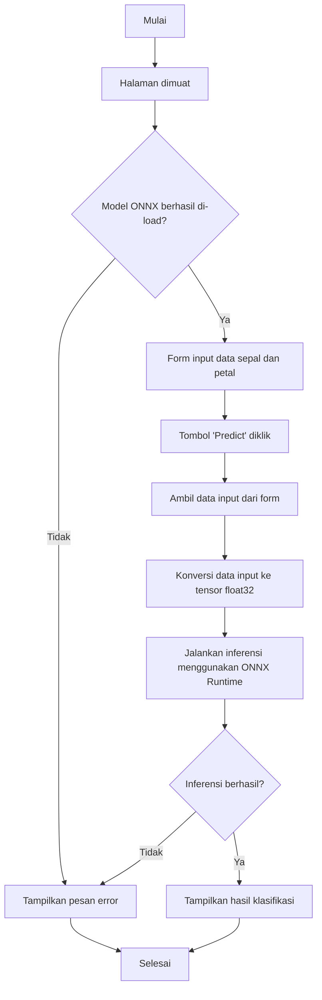

```mermaid
flowchart TD
    A[Mulai] --> B[Halaman dimuat]
    B --> C{Model ONNX berhasil di-load?}
    C -->|Tidak| D[Tampilkan pesan error]
    D --> E[Selesai]
    C -->|Ya| F[Form input data sepal dan petal]
    F --> G[Tombol 'Predict' diklik]
    G --> H[Ambil data input dari form]
    H --> I[Konversi data input ke tensor float32]
    I --> J[Jalankan inferensi menggunakan ONNX Runtime]
    J --> K{Inferensi berhasil?}
    K -->|Tidak| D
    K -->|Ya| L[Tampilkan hasil klasifikasi]
    L --> E[Selesai]
```
